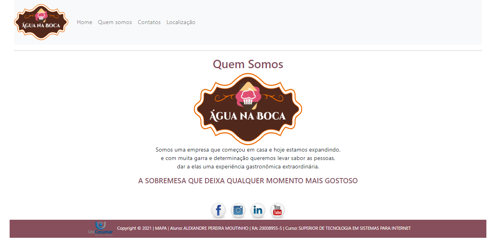
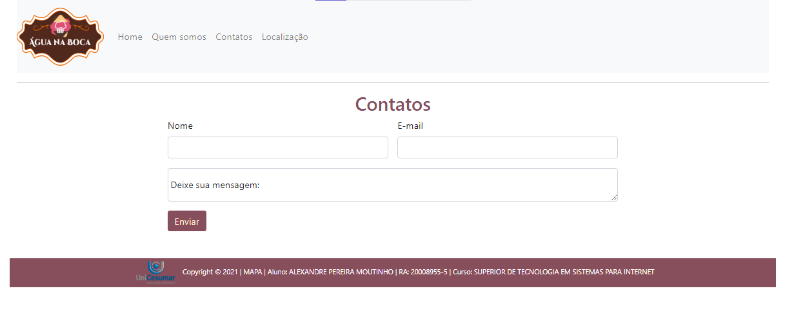
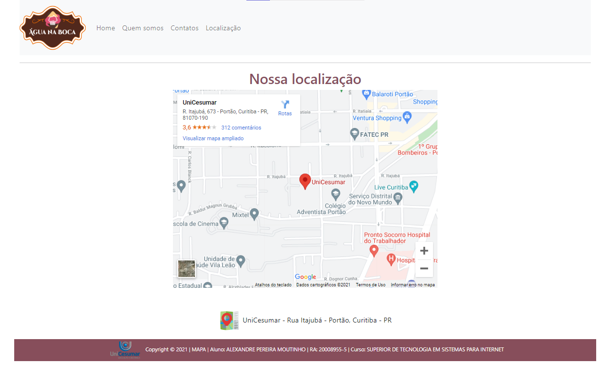
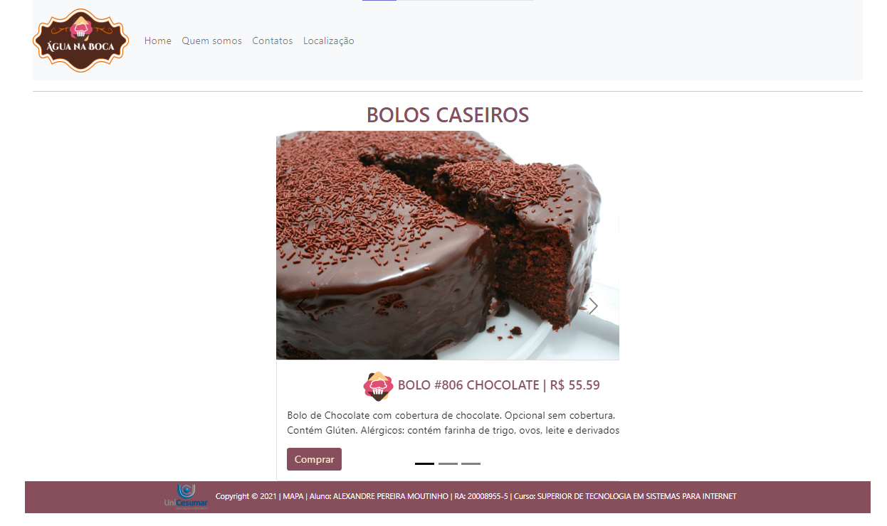

# #-----------------< Ativida de MAPA >----------------#

# Copyright © 2021 | Aluno: ALEXANDRE PEREIRA MOUTINHO  | RA: 20008955-5 

## 📦 Tecnologias utilizadas para construção:
- HTML5 -  Como linguagem de marcação.
- CSS3  -  Para estilização de todos os componentes.
- Bootstrap 5.
- PHP
  
## Preview do projeto

git clone https://github.com/AlexandreQuality/20008955-5_AlexandreMoutinho

